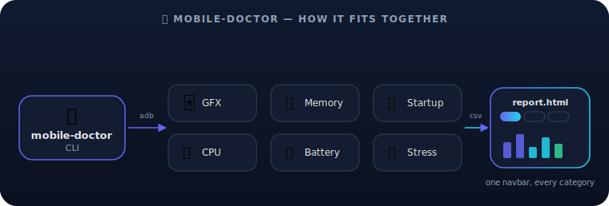

# mobile-doctor

[](https://www.npmjs.com/package/mobile-doctor)

Device-driven diagnostics for mobile apps — GFX/jank, memory, app startup,
CPU, and battery benchmarking, stress/crash testing via monkey, HTML
comparison reports, and device lifecycle management, all from one CLI. No
project-specific package name, coordinates, or paths are hardcoded anywhere
in here.

The CLI itself is built on [`@clack/prompts`](https://github.com/bombshell-dev/clack) —
arrow-key select menus, spinners, and progress bars instead of typed-number
menus and scrolling log spam.



## Table of contents

- [Setup](#setup)
- [Usage](#usage)
- [Commands](#commands)
  - [`devices`](#devices)
  - [`gfx`](#gfx)
  - [`memory`](#memory)
  - [`startup`](#startup)
  - [`cpu`](#cpu)
  - [`battery`](#battery)
  - [`stress`](#stress)
  - [`report`](#report)
- [Adding a new test type or category](#adding-a-new-test-type-or-category)
- [Developing locally](#developing-locally)

## Setup

| | |
|---|---|
| **npm** | `npm install -g mobile-doctor` |
| **yarn** | `yarn global add mobile-doctor` |

Either one puts the `mobile-doctor` command on your `PATH`, usable from any
directory, in any project.

## Usage

```bash
mobile-doctor                # prompts for a command, then walks you through it
mobile-doctor gfx            # skip straight to a command
mobile-doctor gfx --results-dir /path/to/results   # or set MOBILE_DOCTOR_RESULTS_DIR
```

From within a clone of this repo, the same commands are also available as
yarn/npm scripts:

| yarn | npm | equivalent to |
|---|---|---|
| `yarn devices` | `npm run devices` | `mobile-doctor devices` |
| `yarn gfx` | `npm run gfx` | `mobile-doctor gfx` |
| `yarn memory` | `npm run memory` | `mobile-doctor memory` |
| `yarn startup` | `npm run startup` | `mobile-doctor startup` |
| `yarn cpu` | `npm run cpu` | `mobile-doctor cpu` |
| `yarn battery` | `npm run battery` | `mobile-doctor battery` |
| `yarn stress` | `npm run stress` | `mobile-doctor stress` |
| `yarn report` | `npm run report` | `mobile-doctor report` |

## Commands

Every command lives in `src/<command>/index.js` and is auto-discovered — the
picker you see when running `mobile-doctor` with no arguments always
reflects what's actually in `src/`.

| Command | What it does |
|---|---|
| [`devices`](#devices) | Boot an iOS Simulator or Android emulator |
| [`gfx`](#gfx) | Run a GFX/jank benchmark and record the results |
| [`memory`](#memory) | Run a memory benchmark and record the results |
| [`startup`](#startup) | Measure cold/warm app launch time and record the results |
| [`cpu`](#cpu) | Run a CPU usage benchmark and record the results |
| [`battery`](#battery) | Track battery level/temperature during sustained use |
| [`stress`](#stress) | Fuzz the app with random input (monkey) and record crash/ANR outcomes |
| [`report`](#report) | Turn one or more runs from any category into a shareable HTML report |

### `devices`

An interactive, arrow-key device picker — no project-specific coordinates or
package names involved:

1. Select **iOS** (Simulators, via `xcrun simctl`) or **Android**
   (Emulators, via `$ANDROID_HOME/emulator`).
2. Select which simulator/emulator to boot from the ones currently
   available on your machine.

```bash
mobile-doctor devices
```

### `gfx`

Automates the whole Android jank-measurement cycle so you never have to
manually type `adb shell dumpsys gfxinfo` or scroll a screen by hand:

```
reset gfxinfo (adb ... reset) → drive the device → dump gfxinfo/framestats → parse → repeat
```

You'll be prompted for:

| Prompt | Notes |
|---|---|
| **Test type** | `scroll` (repeated swipe up/down), `scroll-aggressive` (faster, back-to-back swipes with minimal settle time — harsher jank test), `tap` (repeated tap at a point), or `navigate` (tap then Back), auto-discovered from `src/lib/test-types/` — shared with `memory` |
| **Package name** | The app under test; remembered between runs |
| **Run name** | Folder name under `results/gfx/`; auto-suffixed (`-1`, `-2`, ...) if it already exists |
| **Iterations** | How many reset → interact → dump cycles to run |
| *(test-type specific)* | e.g. scroll cycle count/duration for `scroll`, tap coordinates/count for `tap` |

Each iteration: resets the app's on-device gfxinfo counters, runs the
interaction (scroll/tap), waits briefly for the counters to settle, then
dumps and parses `dumpsys gfxinfo` and `dumpsys gfxinfo ... framestats`.
The parsed metrics — jank %, frame percentiles, GPU percentiles, missed
vsync, and more (see `src/gfx/lib/gfxinfo-parser.js` for the full list) —
are appended as one row per iteration to `summary.csv`.

```bash
mobile-doctor gfx
```

#### Output

```
results/
  gfx/
    <run-name>/
      summary.csv          # one row per iteration — feed this into `report`
      meta.json             # test type, config used, timestamps
      raw/
        gfxinfo-raw-1.txt    # raw `dumpsys gfxinfo <pkg>` text, per iteration
        framestats-raw-1.txt # raw `dumpsys gfxinfo <pkg> framestats` text, per iteration
```

The raw dumps are kept in their own `raw/` subfolder since `summary.csv`
already has everything parsed out — they're there for the rare case you need
to double check a number against the original `dumpsys` output.

### `memory`

Automates repeated `adb shell dumpsys meminfo` sampling around an
interaction, so you can watch PSS/heap/view-count trend across iterations
instead of eyeballing one-off `dumpsys` dumps:

```
drive the device (navigate/scroll/tap) → dump meminfo → parse → repeat
```

You'll be prompted for:

| Prompt | Notes |
|---|---|
| **Test type** | `navigate` (tap then Back — the default for memory churn), `scroll`, `scroll-aggressive`, or `tap`, auto-discovered from `src/lib/test-types/` — shared with `gfx` |
| **Package name** | The app under test; remembered between runs |
| **Run name** | Folder name under `results/memory/`; auto-suffixed (`-1`, `-2`, ...) if it already exists |
| **Iterations** | How many interact → dump cycles to run |
| *(test-type specific)* | e.g. tap coordinates and Back-wait durations for `navigate` |

Each iteration: runs the interaction, then dumps and parses
`dumpsys meminfo <package>`. The parsed metrics — total PSS, total RSS,
native heap, Dalvik heap, view count, activities, and app contexts (see
`src/memory/lib/meminfo-parser.js` for the full list) — are appended as one
row per iteration to `summary.csv`.

```bash
mobile-doctor memory
```

#### Output

```
results/
  memory/
    <run-name>/
      summary.csv          # one row per iteration — feed this into `report`
      meta.json             # test type, config used, timestamps
      raw/
        meminfo-raw-1.txt    # raw `dumpsys meminfo <pkg>` text, per iteration
```

### `startup`

Automates cold/warm launch timing via `adb shell am start -W`, so you don't
have to force-stop the app and eyeball a one-off launch by hand:

```
force-stop (cold) or press Home (warm) → am start -W → parse TotalTime/WaitTime/ThisTime → repeat
```

You'll be prompted for:

| Prompt | Notes |
|---|---|
| **Package name** | The app under test; its launcher activity is auto-resolved via `cmd package resolve-activity` |
| **Start type** | `cold` (force-stop before every launch — worst case) or `warm` (press Home before every launch — process stays alive) |
| **Run name** | Folder name under `results/startup/`; auto-suffixed (`-1`, `-2`, ...) if it already exists |
| **Iterations** | How many launch cycles to run |
| **Settle time** | Pause between iterations (ms) |

Each iteration parses `TotalTime`, `WaitTime`, `ThisTime`, and `LaunchState`
out of the `am start -W` output (see `src/startup/lib/am-start-parser.js`)
and appends them as one row to `summary.csv`.

```bash
mobile-doctor startup
```

#### Output

```
results/
  startup/
    <run-name>/
      summary.csv          # one row per iteration — feed this into `report`
      meta.json             # start type, config used, timestamps
      raw/
        am-start-raw-1.txt   # raw `am start -W` text, per iteration
```

### `cpu`

Automates `adb shell dumpsys cpuinfo` sampling around an interaction —
reuses the same `scroll`/`tap`/`navigate`/`scroll-aggressive` test types as
`gfx` and `memory`:

```
drive the device (scroll/tap/navigate) → dump cpuinfo → parse → repeat
```

You'll be prompted for the same test-type/package/run-name/iterations flow
as `memory`. Each iteration parses the app's CPU % and the device's total
CPU % from the trailing sample window `dumpsys cpuinfo` reports (see
`src/cpu/lib/cpuinfo-parser.js`) and appends them to `summary.csv`.

```bash
mobile-doctor cpu
```

#### Output

```
results/
  cpu/
    <run-name>/
      summary.csv          # one row per iteration — feed this into `report`
      meta.json             # test type, config used, timestamps
      raw/
        cpuinfo-raw-1.txt    # raw `dumpsys cpuinfo` text, per iteration
```

### `battery`

Tracks battery level, temperature, and voltage via `adb shell dumpsys
battery` around an interaction — same test-type flow as `cpu`/`memory`.
Battery level moves slowly and drains far faster while charging, so for a
meaningful drain trend, unplug the device first (adb over Wi-Fi works fine);
temperature is useful either way as an early signal of thermal throttling.

```bash
mobile-doctor battery
```

If the device is detected as charging during the run, you'll get a warning
and the report calls it out too. A full `dumpsys batterystats --charged`
dump is also saved raw per run, for deeper per-UID attribution beyond the
level/temperature/voltage trend already parsed.

#### Output

```
results/
  battery/
    <run-name>/
      summary.csv           # one row per iteration — feed this into `report`
      meta.json              # test type, config used, timestamps
      raw/
        battery-raw-1.txt     # raw `dumpsys battery` text, per iteration
        batterystats-raw.txt  # raw `dumpsys batterystats --charged <pkg>`, once per run
```

### `stress`

Fuzzes the app with random input via `adb shell monkey`, watching for
crashes and ANRs — a different shape from the other categories: pass/fail
per session rather than a continuous metric.

```
force-stop → monkey -p <pkg> --throttle <ms> -v <count> → parse crash/ANR/stack trace → repeat
```

You'll be prompted for:

| Prompt | Notes |
|---|---|
| **Package name** | The app under test |
| **Run name** | Folder name under `results/stress/`; auto-suffixed (`-1`, `-2`, ...) if it already exists |
| **Sessions** | How many independent monkey sessions to run |
| **Events per session** | Random input events monkey injects per session |
| **Throttle** | Delay between events (ms) |

Each session force-stops the app for a clean slate, then fuzzes it and
parses the output for `// CRASH` / `// NOT RESPONDING` markers, the crash's
short message, and how many of the requested events actually got injected
(see `src/stress/lib/monkey-parser.js`).

```bash
mobile-doctor stress
```

#### Output

```
results/
  stress/
    <run-name>/
      summary.csv          # one row per session — feed this into `report`
      meta.json             # session count, config used, crash/ANR totals
      raw/
        monkey-raw-1.txt     # raw monkey output per session (stack trace lives here on a crash)
```

### `report`

Turns one or more runs from any category (`gfx`, `memory`, `startup`, `cpu`,
`battery`, `stress`) `summary.csv` files into a single self-contained HTML
report — useful for comparing a before/after fix, or a compound-vs-flat
layout, without eyeballing raw CSVs side by side.

```bash
mobile-doctor report
```

If more than one category has runs on disk, you'll first be asked which one
to report on. Then you'll get a checkbox list to pick which run(s) to
include (all selected by default — space to toggle, enter to confirm) and a
name for the report file. It's written to
`results/<category>/reports/<name>.html` and opened in your default browser
automatically. The report includes:

- A **navbar** across the top with one pill per category (🃏 GFX, 🧠 Memory,
  🚀 Startup, 🖥️ CPU, 🔋 Battery, 🐒 Stress). Clicking one jumps straight to
  that category's most recently generated report — categories with no report
  yet show up greyed out instead of a dead link. This is static and frozen
  at generation time (there's no server), so an older report's navbar links
  to whatever existed *when it was generated* — regenerate a report to
  refresh its links to newer reports in other categories.
- A **final-metrics table** comparing the last iteration of every selected
  run, with a % change column between the first and last run picked (`gfx`,
  `memory`, `startup`, `cpu`, `battery`) — `stress` shows a per-session
  pass/fail breakdown and crash/ANR rate per run instead, since it isn't a
  continuous metric.
- **Charts** tailored to the category — jank % over time, frame
  accumulation, and P95/P99 frame percentiles for `gfx`; PSS, native/Dalvik
  heap, and view count over time for `memory`; Total/Wait/This Time for
  `startup`; app vs total device CPU % for `cpu`; level/temperature trend
  for `battery`; crash/ANR rate and event completion % for `stress` — one
  line/bar per run.

## Adding a new test type or category

Only necessary if the existing `scroll`/`tap`/`navigate`/`scroll-aggressive`
test types (or `devices`/`gfx`/`memory`/`startup`/`cpu`/`battery`/`stress`/
`report` commands) don't cover what you need — most day-to-day usage is
just running the commands above.

**A new test type** (shared by `gfx`, `memory`, and `cpu`) — create
`src/lib/test-types/<name>.js`:

```js
module.exports = {
  id: "my-test",
  description: "One line shown in the test-type picker",
  async promptConfig({ prompt, adb }) {
    return { /* config object, passed to run() */ };
  },
  async run({ adb, config, log }) {
    // drive the device via `adb` (see src/lib/adb.js), call log(message)
    // for progress output
  },
};
```

**A new top-level command** — create `src/<command>/index.js`:

```js
module.exports = {
  id: "network",
  description: "One line shown in the command picker",
  async run({ adb, prompt, resultsRoot, configStore, log }) {
    // own interactive flow, own result folder under resultsRoot/<command>/
  },
};
```

Either one shows up in its picker automatically — nothing else to wire up.
Shared helpers (`adb`, `prompt`, `unique-name`, `config-store`) live in
`src/lib/` and are meant to be reused across every command.

If your command loops iterations with a `createProgress` bar (see
`src/lib/progress.js`) around a test-type interaction, route the
interaction's own step messages through `progress.advance(0, message)`
instead of the top-level `log` — interleaving plain `log()` writes with the
progress bar's redraw interval corrupts its cursor tracking. `gfx`, `memory`,
`cpu`, and `battery` all do this; see any of them for the pattern.

To make a new category reportable, add a `src/<command>/template.html`
(copy an existing one as a starting point — they share the same CSS shell
and navbar) and register it in `REPORTABLE_CATEGORIES` in
`src/report/index.js`.

## Developing locally

Working on `mobile-doctor` itself? Link it instead of installing it:

```bash
git clone https://github.com/Kaveh-ap/mobile-doctor.git
cd mobile-doctor
yarn install       # installs @clack/prompts, the only runtime dependency
yarn link          # exposes `mobile-doctor` globally, pointing at this clone
```
